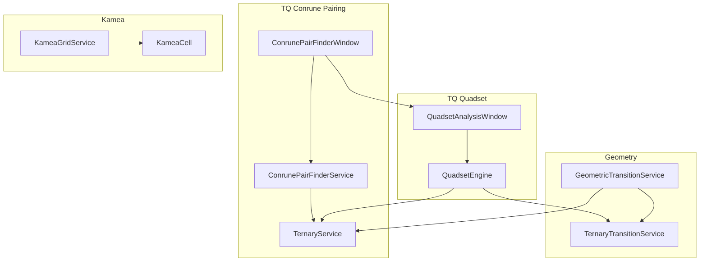
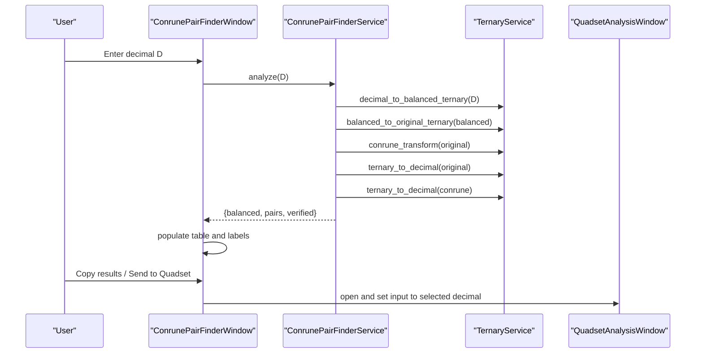
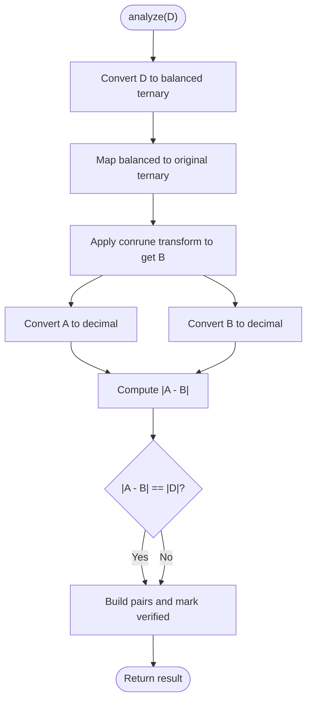
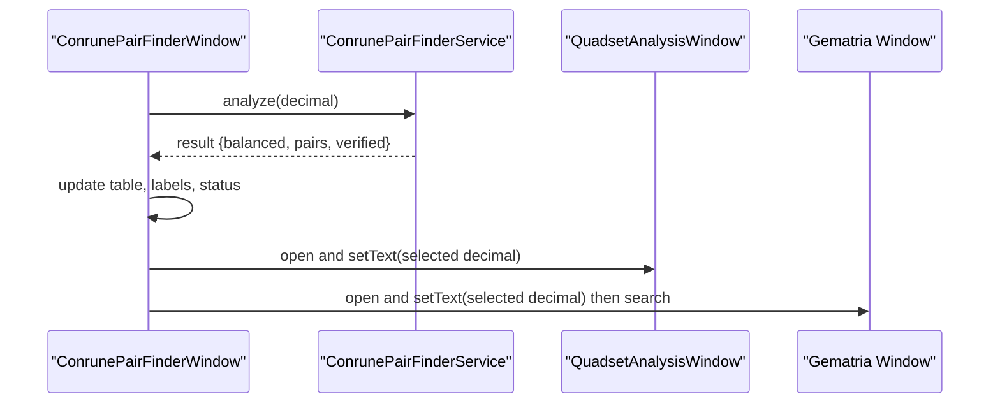
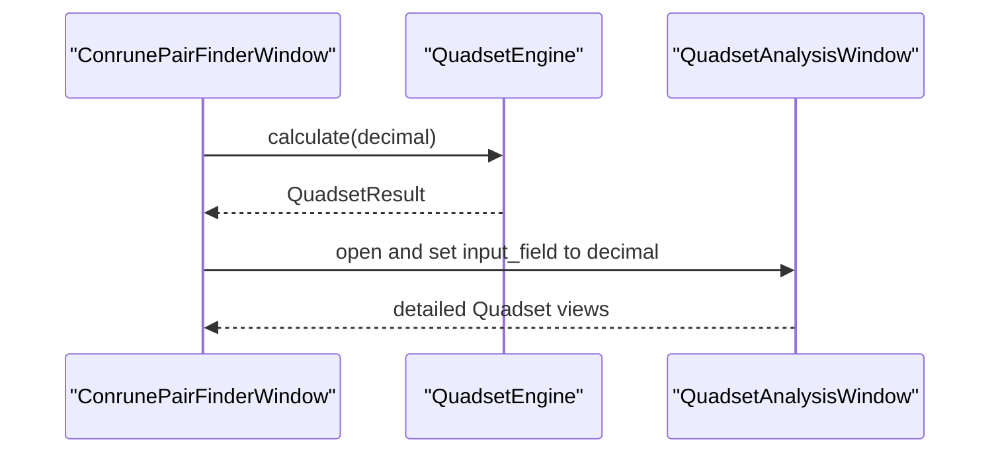
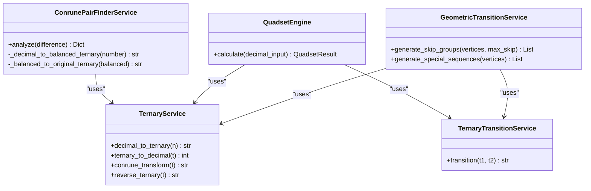
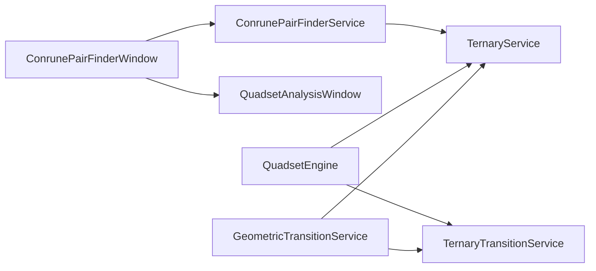

# Conrune Pairing

<cite>
**Referenced Files in This Document**
- [conrune_pair_finder_service.py](file://src/pillars/tq/services/conrune_pair_finder_service.py)
- [conrune_pair_finder_window.py](file://src/pillars/tq/ui/conrune_pair_finder_window.py)
- [ternary_service.py](file://src/pillars/tq/services/ternary_service.py)
- [quadset_engine.py](file://src/pillars/tq/services/quadset_engine.py)
- [quadset_analysis_window.py](file://src/pillars/tq/ui/quadset_analysis_window.py)
- [kamea_grid_service.py](file://src/pillars/tq/services/kamea_grid_service.py)
- [kamea_cell.py](file://src/pillars/tq/models/kamea_cell.py)
- [cipher_token.py](file://src/pillars/tq/models/cipher_token.py)
- [cipher_correspondence.csv](file://src/pillars/tq/data/cipher_correspondence.csv)
- [ternary_transition_service.py](file://src/pillars/tq/services/ternary_transition_service.py)
- [geometric_transition_service.py](file://src/pillars/tq/services/geometric_transition_service.py)
</cite>

## Table of Contents
1. [Introduction](#introduction)
2. [Project Structure](#project-structure)
3. [Core Components](#core-components)
4. [Architecture Overview](#architecture-overview)
5. [Detailed Component Analysis](#detailed-component-analysis)
6. [Dependency Analysis](#dependency-analysis)
7. [Performance Considerations](#performance-considerations)
8. [Troubleshooting Guide](#troubleshooting-guide)
9. [Conclusion](#conclusion)
10. [Appendices](#appendices)

## Introduction
This document explains the Conrune Pairing subsystem of the TQ pillar. It focuses on how conrune_pair_finder_service identifies meaningful rune pairings based on numerical and geometric criteria, how the conrune_pair_finder_window UI presents results and enables exploration, and how pairing integrates with other TQ systems such as Quadset analysis and geometric transitions. The goal is to make the pairing logic accessible to beginners while providing sufficient technical depth for experienced developers.

## Project Structure
The Conrune Pairing subsystem spans a small set of focused services and a dedicated UI window:
- Services: conrune_pair_finder_service orchestrates balanced ternary conversion and pair generation; ternary_service provides base conversions and transformations; quadset_engine and quadset_analysis_window provide broader Quadset analysis for comparison and cross-pillar workflows.
- UI: conrune_pair_finder_window renders results, supports copy-to-clipboard, and sends values to Quadset Analysis for deeper exploration.
- Data and models: cipher_token and cipher_correspondence define the TQ Base-27 Cipher mapping; kamea_grid_service and kamea_cell model the 27x27 Kamea grid used in Quadset analysis and geometric transitions.

**Diagram sources**
- [conrune_pair_finder_service.py](file://src/pillars/tq/services/conrune_pair_finder_service.py#L1-L82)
- [conrune_pair_finder_window.py](file://src/pillars/tq/ui/conrune_pair_finder_window.py#L1-L398)
- [ternary_service.py](file://src/pillars/tq/services/ternary_service.py#L1-L114)
- [quadset_engine.py](file://src/pillars/tq/services/quadset_engine.py#L1-L87)
- [quadset_analysis_window.py](file://src/pillars/tq/ui/quadset_analysis_window.py#L1-L986)
- [geometric_transition_service.py](file://src/pillars/tq/services/geometric_transition_service.py#L1-L323)
- [ternary_transition_service.py](file://src/pillars/tq/services/ternary_transition_service.py#L1-L70)
- [kamea_grid_service.py](file://src/pillars/tq/services/kamea_grid_service.py#L1-L220)
- [kamea_cell.py](file://src/pillars/tq/models/kamea_cell.py#L1-L59)

**Section sources**
- [conrune_pair_finder_service.py](file://src/pillars/tq/services/conrune_pair_finder_service.py#L1-L82)
- [conrune_pair_finder_window.py](file://src/pillars/tq/ui/conrune_pair_finder_window.py#L1-L398)
- [ternary_service.py](file://src/pillars/tq/services/ternary_service.py#L1-L114)
- [quadset_engine.py](file://src/pillars/tq/services/quadset_engine.py#L1-L87)
- [quadset_analysis_window.py](file://src/pillars/tq/ui/quadset_analysis_window.py#L1-L986)
- [geometric_transition_service.py](file://src/pillars/tq/services/geometric_transition_service.py#L1-L323)
- [ternary_transition_service.py](file://src/pillars/tq/services/ternary_transition_service.py#L1-L70)
- [kamea_grid_service.py](file://src/pillars/tq/services/kamea_grid_service.py#L1-L220)
- [kamea_cell.py](file://src/pillars/tq/models/kamea_cell.py#L1-L59)

## Core Components
- ConrunePairFinderService: Computes balanced ternary from a target difference D, derives original and conrune ternary forms, converts back to decimals, and verifies |A - B| equals D. Returns a structured result including balanced form, pair list, and verification flag.
- TernaryService: Provides decimal-to-ternary, ternary-to-decimal, conrune transform, and reversal operations.
- ConrunePairFinderWindow: Presents the balanced ternary, pair table, difference verification, and actions to copy results or send the first pair to Quadset Analysis.

Key outputs and behaviors:
- Balanced ternary mapping uses a special negative symbol to represent -1 digits.
- Conrune transform swaps 0↔0, 1↔2, leaving 0 unchanged.
- Verification ensures the computed difference matches the expected absolute difference.

**Section sources**
- [conrune_pair_finder_service.py](file://src/pillars/tq/services/conrune_pair_finder_service.py#L1-L82)
- [ternary_service.py](file://src/pillars/tq/services/ternary_service.py#L1-L114)
- [conrune_pair_finder_window.py](file://src/pillars/tq/ui/conrune_pair_finder_window.py#L1-L398)

## Architecture Overview
The pairing subsystem is a thin pipeline:
- Input: A decimal difference D.
- Processing: Convert D to balanced ternary; map to original ternary; apply conrune transform to get B; convert both A and B to decimals; compute and compare |A - B|.
- Output: Balanced ternary, pair table, difference labels, and verification status.

Integration points:
- Quadset Analysis: The UI can send either pair’s decimal value to QuadsetAnalysisWindow for deeper analysis.
- Geometric Transitions: QuadsetEngine and GeometricTransitionService both leverage ternary conversions and transitions, enabling cross-perspective analysis.

**Diagram sources**
- [conrune_pair_finder_window.py](file://src/pillars/tq/ui/conrune_pair_finder_window.py#L196-L398)
- [conrune_pair_finder_service.py](file://src/pillars/tq/services/conrune_pair_finder_service.py#L27-L82)
- [ternary_service.py](file://src/pillars/tq/services/ternary_service.py#L1-L114)
- [quadset_analysis_window.py](file://src/pillars/tq/ui/quadset_analysis_window.py#L1-L986)

## Detailed Component Analysis

### ConrunePairFinderService
- Responsibilities:
  - Convert decimal difference D to balanced ternary.
  - Map balanced ternary to original ternary.
  - Compute conrune ternary via conrune transform.
  - Convert A and B back to decimals and verify |A - B| == |D|.
  - Return structured results including balanced form, pair list, and verification.
- Implementation highlights:
  - Balanced ternary uses a special negative symbol to represent -1 digits.
  - Conrune transform swaps 1↔2 while preserving 0.
  - Decimal conversions handle zero and empty strings gracefully.

**Diagram sources**
- [conrune_pair_finder_service.py](file://src/pillars/tq/services/conrune_pair_finder_service.py#L27-L82)

**Section sources**
- [conrune_pair_finder_service.py](file://src/pillars/tq/services/conrune_pair_finder_service.py#L1-L82)

### ConrunePairFinderWindow
- Responsibilities:
  - Render input, balanced ternary, pair table, difference labels, and status.
  - Validate user input and trigger analysis.
  - Provide context menus for each numeric cell to send to Quadset or look up in the Gematria database.
  - Copy results to clipboard in a readable format.
- Interaction highlights:
  - On input change, parses integer, calls service.analyze, updates UI, and toggles action buttons.
  - Context menus support sending values to QuadsetAnalysisWindow and opening Gematria lookup windows.
  - Rounded values are sent to ensure clean integration across pillars.

**Diagram sources**
- [conrune_pair_finder_window.py](file://src/pillars/tq/ui/conrune_pair_finder_window.py#L196-L398)
- [quadset_analysis_window.py](file://src/pillars/tq/ui/quadset_analysis_window.py#L1-L986)

**Section sources**
- [conrune_pair_finder_window.py](file://src/pillars/tq/ui/conrune_pair_finder_window.py#L1-L398)

### Integration with Quadset Analysis
- QuadsetEngine performs a full Quadset analysis including Original, Conrune, Reversal, Conrune of Reversal, upper/lower differences, transgram, and pattern analysis.
- ConrunePairFinderWindow can send either pair’s decimal value to QuadsetAnalysisWindow for deeper exploration.
- The Quadset UI exposes tabs for each member and advanced summaries, enabling cross-checking of pairing results against broader Quadset patterns.

**Diagram sources**
- [quadset_engine.py](file://src/pillars/tq/services/quadset_engine.py#L1-L87)
- [quadset_analysis_window.py](file://src/pillars/tq/ui/quadset_analysis_window.py#L1-L986)
- [conrune_pair_finder_window.py](file://src/pillars/tq/ui/conrune_pair_finder_window.py#L324-L398)

**Section sources**
- [quadset_engine.py](file://src/pillars/tq/services/quadset_engine.py#L1-L87)
- [quadset_analysis_window.py](file://src/pillars/tq/ui/quadset_analysis_window.py#L1-L986)
- [conrune_pair_finder_window.py](file://src/pillars/tq/ui/conrune_pair_finder_window.py#L324-L398)

### Integration with Geometric Transitions
- QuadsetEngine uses TernaryTransitionService to compute transgram and other transitions.
- GeometricTransitionService generates transitions on regular polygons using ternary values and applies TernaryTransitionService to produce result decimals.
- ConrunePairFinderService relies on TernaryService for conversions and transforms, aligning with the broader transition system.

**Diagram sources**
- [conrune_pair_finder_service.py](file://src/pillars/tq/services/conrune_pair_finder_service.py#L1-L82)
- [ternary_service.py](file://src/pillars/tq/services/ternary_service.py#L1-L114)
- [quadset_engine.py](file://src/pillars/tq/services/quadset_engine.py#L1-L87)
- [ternary_transition_service.py](file://src/pillars/tq/services/ternary_transition_service.py#L1-L70)
- [geometric_transition_service.py](file://src/pillars/tq/services/geometric_transition_service.py#L1-L323)

**Section sources**
- [ternary_service.py](file://src/pillars/tq/services/ternary_service.py#L1-L114)
- [ternary_transition_service.py](file://src/pillars/tq/services/ternary_transition_service.py#L1-L70)
- [geometric_transition_service.py](file://src/pillars/tq/services/geometric_transition_service.py#L1-L323)
- [quadset_engine.py](file://src/pillars/tq/services/quadset_engine.py#L1-L87)

### Kamea Grid and Cipher Tokens
- KameaGridService loads and exposes the 27x27 grid, mapping decimal values to ternary bigrams and providing Quadset chord values.
- KameaCell defines attributes and convenience properties, including a conrune vector magnitude computed as |self - conrune(self)|.
- CipherToken and cipher_correspondence define the TQ Base-27 Cipher mapping for categorical, symbolic, and alphabetic correspondences.

These components underpin Quadset analysis and geometric transitions, complementing Conrune Pairing by providing spatial and categorical context.

**Section sources**
- [kamea_grid_service.py](file://src/pillars/tq/services/kamea_grid_service.py#L1-L220)
- [kamea_cell.py](file://src/pillars/tq/models/kamea_cell.py#L1-L59)
- [cipher_token.py](file://src/pillars/tq/models/cipher_token.py#L1-L35)
- [cipher_correspondence.csv](file://src/pillars/tq/data/cipher_correspondence.csv#L1-L29)

## Dependency Analysis
- ConrunePairFinderService depends on TernaryService for balanced ternary conversion and transforms.
- ConrunePairFinderWindow depends on ConrunePairFinderService and opens QuadsetAnalysisWindow for cross-pillar workflows.
- QuadsetEngine depends on TernaryService and TernaryTransitionService to compute Quadset members and transgram.
- GeometricTransitionService depends on TernaryService and TernaryTransitionService to compute polygonal transitions.

**Diagram sources**
- [conrune_pair_finder_service.py](file://src/pillars/tq/services/conrune_pair_finder_service.py#L1-L82)
- [conrune_pair_finder_window.py](file://src/pillars/tq/ui/conrune_pair_finder_window.py#L1-L398)
- [quadset_engine.py](file://src/pillars/tq/services/quadset_engine.py#L1-L87)
- [ternary_service.py](file://src/pillars/tq/services/ternary_service.py#L1-L114)
- [ternary_transition_service.py](file://src/pillars/tq/services/ternary_transition_service.py#L1-L70)
- [geometric_transition_service.py](file://src/pillars/tq/services/geometric_transition_service.py#L1-L323)

**Section sources**
- [conrune_pair_finder_service.py](file://src/pillars/tq/services/conrune_pair_finder_service.py#L1-L82)
- [conrune_pair_finder_window.py](file://src/pillars/tq/ui/conrune_pair_finder_window.py#L1-L398)
- [quadset_engine.py](file://src/pillars/tq/services/quadset_engine.py#L1-L87)
- [ternary_service.py](file://src/pillars/tq/services/ternary_service.py#L1-L114)
- [ternary_transition_service.py](file://src/pillars/tq/services/ternary_transition_service.py#L1-L70)
- [geometric_transition_service.py](file://src/pillars/tq/services/geometric_transition_service.py#L1-L323)

## Performance Considerations
- Balanced ternary conversion is linear in the number of digits; for typical decimal differences, this is negligible.
- Ternary conversions and transforms are O(n) where n is the number of digits; both are fast for practical ranges.
- Quadset analysis involves multiple conversions and property computations; caching or memoization could reduce repeated work if invoked frequently.
- UI responsiveness: The window updates the table and labels on each keystroke; ensure input validation prevents excessive recomputation for invalid entries.
- Kamea grid initialization loads CSVs once and stores in memory; subsequent lookups are O(1) via dictionaries.

[No sources needed since this section provides general guidance]

## Troubleshooting Guide
Common issues and solutions:
- Invalid input: The UI clears results and disables actions when input is empty or non-integer. Ensure the input field contains a valid integer before expecting results.
- Verification mismatch: If the computed |A - B| does not equal |D|, the status turns red. Recompute or verify the balanced ternary mapping.
- Sending to Quadset: Requires a window manager; if disabled, ensure the application window manager is configured.
- Database lookup: If disabled, ensure the window manager supports the target window type.
- Kamea grid errors: Initialization logs errors and raises exceptions if CSV parsing fails; verify file paths and CSV integrity.

**Section sources**
- [conrune_pair_finder_window.py](file://src/pillars/tq/ui/conrune_pair_finder_window.py#L196-L398)
- [kamea_grid_service.py](file://src/pillars/tq/services/kamea_grid_service.py#L1-L220)

## Conclusion
The Conrune Pairing subsystem cleanly separates concerns: a compact service computes balanced ternary mappings and validates pair differences, while a focused UI presents results and facilitates deeper analysis via Quadset and geometric transition services. The design emphasizes clarity and composability, enabling seamless integration across TQ pillars.

[No sources needed since this section summarizes without analyzing specific files]

## Appendices

### Concrete Examples from the Codebase
- Balanced ternary mapping and pair generation:
  - See [analyze](file://src/pillars/tq/services/conrune_pair_finder_service.py#L27-L82) for the core computation pipeline.
- UI-driven workflows:
  - See [_handle_input_change](file://src/pillars/tq/ui/conrune_pair_finder_window.py#L196-L236) for input handling and result population.
  - See [_copy_results](file://src/pillars/tq/ui/conrune_pair_finder_window.py#L325-L338) for clipboard export.
  - See [_send_first_pair_to_quadset](file://src/pillars/tq/ui/conrune_pair_finder_window.py#L339-L344) for cross-pillar integration.
- Quadset integration:
  - See [QuadsetEngine.calculate](file://src/pillars/tq/services/quadset_engine.py#L19-L81) for the full Quadset pipeline.
  - See [QuadsetAnalysisWindow](file://src/pillars/tq/ui/quadset_analysis_window.py#L175-L986) for the UI presentation.
- Geometric transitions:
  - See [GeometricTransitionService.generate_skip_groups](file://src/pillars/tq/services/geometric_transition_service.py#L126-L154) for polygonal transitions.
  - See [TernaryTransitionService.transition](file://src/pillars/tq/services/ternary_transition_service.py#L27-L47) for digit-wise transition logic.

**Section sources**
- [conrune_pair_finder_service.py](file://src/pillars/tq/services/conrune_pair_finder_service.py#L27-L82)
- [conrune_pair_finder_window.py](file://src/pillars/tq/ui/conrune_pair_finder_window.py#L196-L344)
- [quadset_engine.py](file://src/pillars/tq/services/quadset_engine.py#L19-L81)
- [quadset_analysis_window.py](file://src/pillars/tq/ui/quadset_analysis_window.py#L175-L986)
- [geometric_transition_service.py](file://src/pillars/tq/services/geometric_transition_service.py#L126-L154)
- [ternary_transition_service.py](file://src/pillars/tq/services/ternary_transition_service.py#L27-L47)