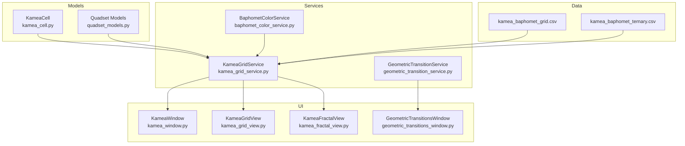
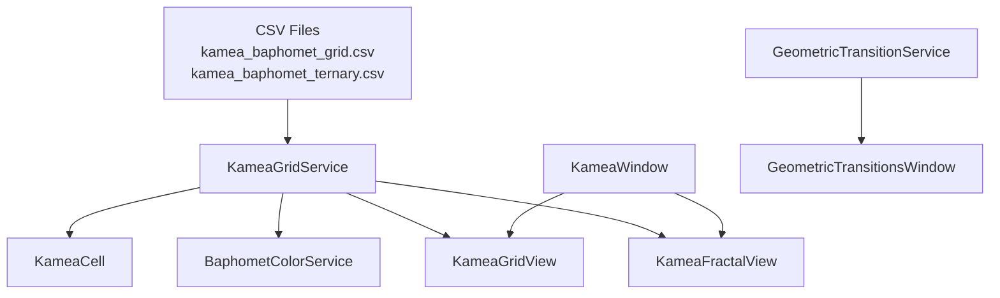
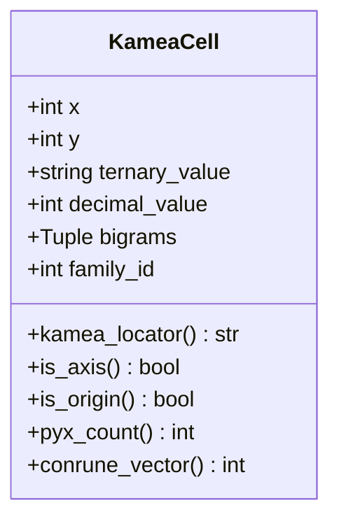
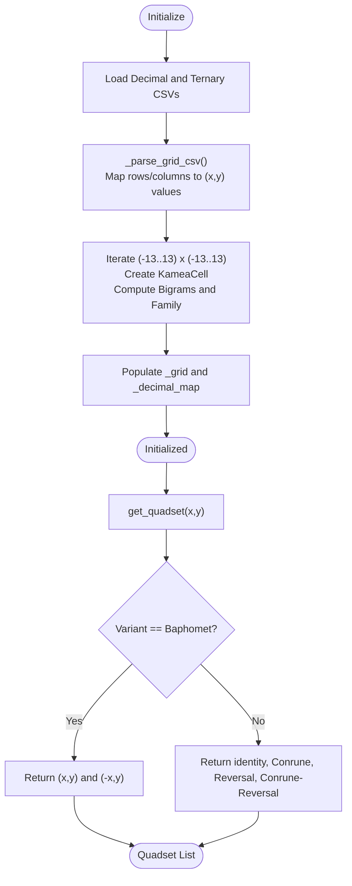
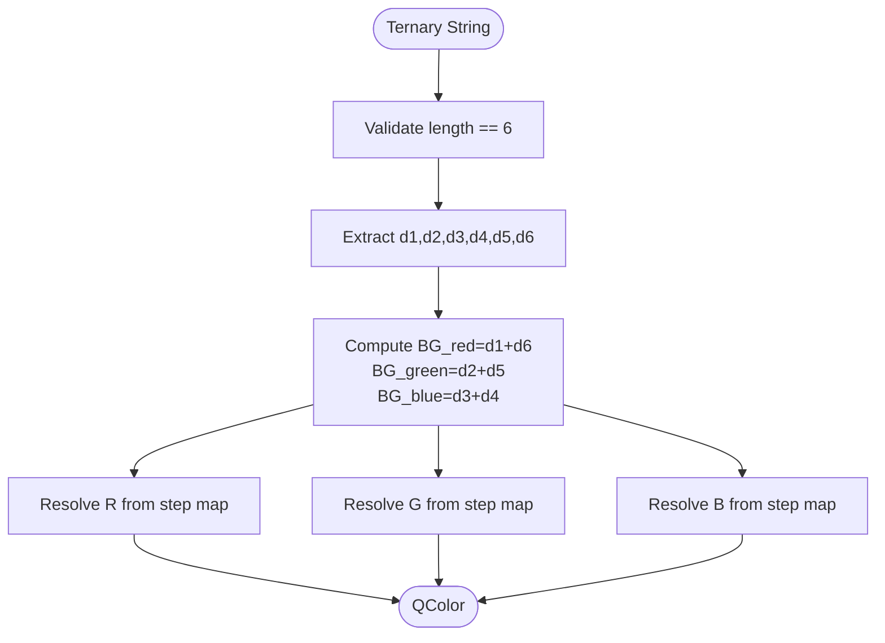
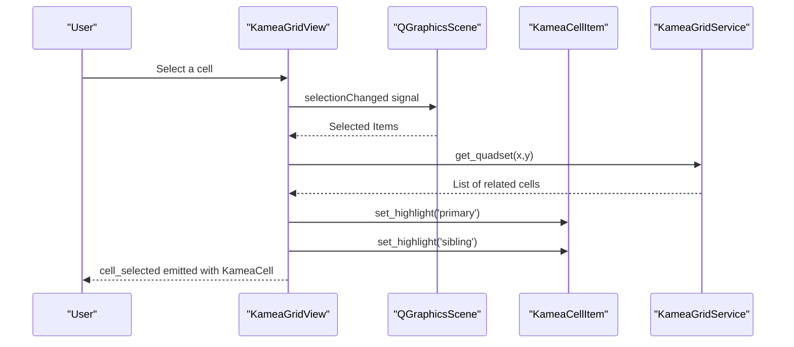
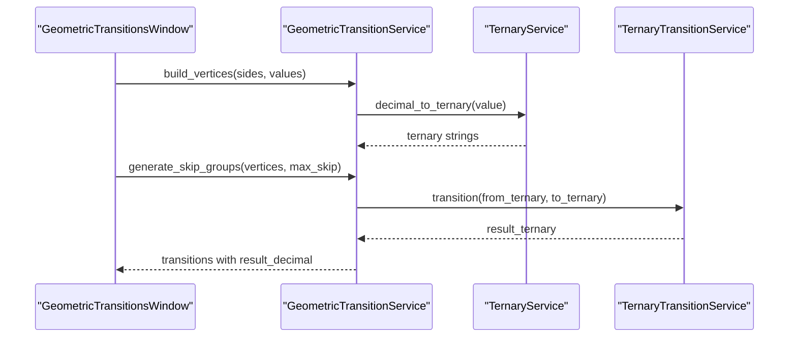
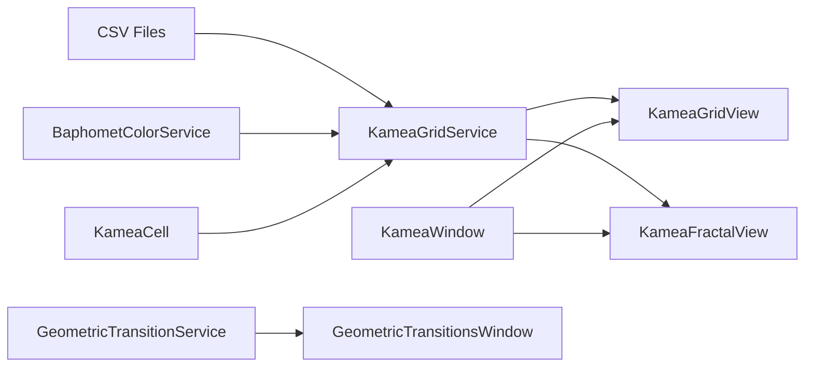

# Kamea Grids

<cite>
**Referenced Files in This Document**
- [kamea_cell.py](file://src/pillars/tq/models/kamea_cell.py)
- [kamea_grid_service.py](file://src/pillars/tq/services/kamea_grid_service.py)
- [kamea_grid_view.py](file://src/pillars/tq/ui/kamea_grid_view.py)
- [kamea_window.py](file://src/pillars/tq/ui/kamea_window.py)
- [baphomet_color_service.py](file://src/pillars/tq/services/baphomet_color_service.py)
- [kamea_baphomet_grid.csv](file://src/pillars/tq/data/kamea_baphomet_grid.csv)
- [kamea_baphomet_ternary.csv](file://src/pillars/tq/data/kamea_baphomet_ternary.csv)
- [quadset_models.py](file://src/pillars/tq/models/quadset_models.py)
- [kamea_fractal_view.py](file://src/pillars/tq/ui/kamea_fractal_view.py)
- [geometric_transition_service.py](file://src/pillars/tq/services/geometric_transition_service.py)
- [geometric_transitions_window.py](file://src/pillars/tq/ui/geometric_transitions_window.py)
- [The_Kamea_Doctrine.md](file://Docs/kamea/The_Kamea_Doctrine.md)
- [ternary_transition_system.md](file://Docs/kamea/ternary_transition_system.md)
- [temp_verify_kamea.py](file://temp_verify_kamea.py)
</cite>

## Table of Contents
1. [Introduction](#introduction)
2. [Project Structure](#project-structure)
3. [Core Components](#core-components)
4. [Architecture Overview](#architecture-overview)
5. [Detailed Component Analysis](#detailed-component-analysis)
6. [Dependency Analysis](#dependency-analysis)
7. [Performance Considerations](#performance-considerations)
8. [Troubleshooting Guide](#troubleshooting-guide)
9. [Conclusion](#conclusion)
10. [Appendices](#appendices)

## Introduction
This document explains the Kamea Grids subsystem within the TQ pillar. It covers how the Kamea grid is modeled, loaded, and rendered; how cell transformations and Quadset physics are computed; how colors are mapped; and how the grid connects to higher-dimensional geometry and transitions. It also provides practical guidance for handling large grids and common rendering issues.

## Project Structure
The Kamea Grids subsystem spans models, services, UI views, and data files:
- Models define the KameaCell data structure and Quadset analysis models.
- Services load CSV data, parse grid coordinates, compute Quadsets, and resolve colors.
- UI components render the 2D grid and a 3D fractal visualization.
- Data files provide the 27x27 grid’s decimal and ternary mappings.

**Diagram sources**
- [kamea_cell.py](file://src/pillars/tq/models/kamea_cell.py#L1-L59)
- [quadset_models.py](file://src/pillars/tq/models/quadset_models.py#L1-L41)
- [kamea_grid_service.py](file://src/pillars/tq/services/kamea_grid_service.py#L1-L220)
- [baphomet_color_service.py](file://src/pillars/tq/services/baphomet_color_service.py#L1-L62)
- [kamea_grid_view.py](file://src/pillars/tq/ui/kamea_grid_view.py#L1-L268)
- [kamea_window.py](file://src/pillars/tq/ui/kamea_window.py#L1-L194)
- [kamea_fractal_view.py](file://src/pillars/tq/ui/kamea_fractal_view.py#L1-L457)
- [geometric_transition_service.py](file://src/pillars/tq/services/geometric_transition_service.py#L1-L323)
- [geometric_transitions_window.py](file://src/pillars/tq/ui/geometric_transitions_window.py#L1-L875)
- [kamea_baphomet_grid.csv](file://src/pillars/tq/data/kamea_baphomet_grid.csv#L1-L29)
- [kamea_baphomet_ternary.csv](file://src/pillars/tq/data/kamea_baphomet_ternary.csv)

**Section sources**
- [kamea_cell.py](file://src/pillars/tq/models/kamea_cell.py#L1-L59)
- [kamea_grid_service.py](file://src/pillars/tq/services/kamea_grid_service.py#L1-L220)
- [kamea_grid_view.py](file://src/pillars/tq/ui/kamea_grid_view.py#L1-L268)
- [kamea_window.py](file://src/pillars/tq/ui/kamea_window.py#L1-L194)
- [baphomet_color_service.py](file://src/pillars/tq/services/baphomet_color_service.py#L1-L62)
- [kamea_baphomet_grid.csv](file://src/pillars/tq/data/kamea_baphomet_grid.csv#L1-L29)
- [kamea_baphomet_ternary.csv](file://src/pillars/tq/data/kamea_baphomet_ternary.csv)
- [quadset_models.py](file://src/pillars/tq/models/quadset_models.py#L1-L41)
- [kamea_fractal_view.py](file://src/pillars/tq/ui/kamea_fractal_view.py#L1-L457)
- [geometric_transition_service.py](file://src/pillars/tq/services/geometric_transition_service.py#L1-L323)
- [geometric_transitions_window.py](file://src/pillars/tq/ui/geometric_transitions_window.py#L1-L875)
- [The_Kamea_Doctrine.md](file://Docs/kamea/The_Kamea_Doctrine.md#L1-L203)
- [ternary_transition_system.md](file://Docs/kamea/ternary_transition_system.md#L1-L158)
- [temp_verify_kamea.py](file://temp_verify_kamea.py#L1-L79)

## Core Components
- KameaCell: Immutable data model for a grid cell with x/y coordinates, decimal value, 6-digit ternary value, bigram tuple (Region/Area/Skin), and derived properties (locator, axis checks, pyx count, Conrune vector).
- KameaGridService: Loads CSVs, constructs KameaCell instances, computes Quadsets, resolves colors, and exposes chord values for decimal inputs.
- BaphometColorService: Maps a 6-digit ternary string to an RGB color using Bigram-derived channels.
- KameaGridView: Renders the 27x27 grid as selectable cells with tooltips, highlighting, and filtering by dimensional density (pyx count).
- KameaWindow: Orchestrates the grid view and side panels, toggling between 2D and 3D views and connecting selection events to mutation panels.
- KameaFractalView: 3D visualization of the 6D hypercube projection, showing dimensional strata and tree connections.
- Quadset models: Data carriers for Quadset analysis results.

**Section sources**
- [kamea_cell.py](file://src/pillars/tq/models/kamea_cell.py#L1-L59)
- [kamea_grid_service.py](file://src/pillars/tq/services/kamea_grid_service.py#L1-L220)
- [baphomet_color_service.py](file://src/pillars/tq/services/baphomet_color_service.py#L1-L62)
- [kamea_grid_view.py](file://src/pillars/tq/ui/kamea_grid_view.py#L1-L268)
- [kamea_window.py](file://src/pillars/tq/ui/kamea_window.py#L1-L194)
- [kamea_fractal_view.py](file://src/pillars/tq/ui/kamea_fractal_view.py#L1-L457)
- [quadset_models.py](file://src/pillars/tq/models/quadset_models.py#L1-L41)

## Architecture Overview
The subsystem follows a layered architecture:
- Data layer: CSV files encode the 27x27 grid’s decimal and ternary mappings.
- Model layer: KameaCell encapsulates cell semantics and derived properties.
- Service layer: KameaGridService orchestrates parsing, Quadset computation, and color resolution.
- UI layer: KameaGridView renders the grid; KameaWindow manages panels and view switching; KameaFractalView renders the 3D hypercube.
- Related services: GeometricTransitionService and GeometricTransitionsWindow enable polygon-based transitions and display results.

**Diagram sources**
- [kamea_grid_service.py](file://src/pillars/tq/services/kamea_grid_service.py#L1-L220)
- [kamea_cell.py](file://src/pillars/tq/models/kamea_cell.py#L1-L59)
- [baphomet_color_service.py](file://src/pillars/tq/services/baphomet_color_service.py#L1-L62)
- [kamea_grid_view.py](file://src/pillars/tq/ui/kamea_grid_view.py#L1-L268)
- [kamea_window.py](file://src/pillars/tq/ui/kamea_window.py#L1-L194)
- [kamea_fractal_view.py](file://src/pillars/tq/ui/kamea_fractal_view.py#L1-L457)
- [geometric_transition_service.py](file://src/pillars/tq/services/geometric_transition_service.py#L1-L323)
- [geometric_transitions_window.py](file://src/pillars/tq/ui/geometric_transitions_window.py#L1-L875)
- [kamea_baphomet_grid.csv](file://src/pillars/tq/data/kamea_baphomet_grid.csv#L1-L29)
- [kamea_baphomet_ternary.csv](file://src/pillars/tq/data/kamea_baphomet_ternary.csv)

## Detailed Component Analysis

### KameaCell Data Model
KameaCell captures:
- Positional coordinates x, y in the range [-13, 13].
- Decimal value and 6-digit ternary string.
- Bigrams (Region, Area, Cell) derived from the ternary digits.
- Derived properties:
  - kamea_locator: a Region-Area-Cell string identifier.
  - is_axis: True if x==0 or y==0.
  - is_origin: True if x==0 and y==0.
  - pyx_count: count of zeros (dimensional density).
  - conrune_vector: magnitude of distance between a value and its Conrune.

**Diagram sources**
- [kamea_cell.py](file://src/pillars/tq/models/kamea_cell.py#L1-L59)

**Section sources**
- [kamea_cell.py](file://src/pillars/tq/models/kamea_cell.py#L1-L59)

### KameaGridService: Grid Loading, Parsing, Quadsets, and Colors
Responsibilities:
- Initialize from CSVs (default Maut or Baphomet variants).
- Parse CSVs with headers for X coordinates and first column for Y coordinates.
- Build KameaCell instances and populate reverse lookup maps.
- Compute Quadsets:
  - Baphomet variant: horizontal reflection pairs (x, y) and (-x, y).
  - Maut variant: full Quadset (identity, Conrune, Conrune-Reversal, Reversal).
- Resolve colors via BaphometColorService.
- Provide chord values for decimal inputs by mapping to coordinates and returning unique Quadset values.

**Diagram sources**
- [kamea_grid_service.py](file://src/pillars/tq/services/kamea_grid_service.py#L1-L220)

**Section sources**
- [kamea_grid_service.py](file://src/pillars/tq/services/kamea_grid_service.py#L1-L220)

### BaphometColorService: Color Mapping from Ternary Bigrams
- Extracts three Bigrams from indices (0,5), (1,4), (2,3) to form Red, Green, Blue intensities.
- Uses a step map to convert each Bigram to an intensity value.
- Returns a QColor based on computed RGB.

**Diagram sources**
- [baphomet_color_service.py](file://src/pillars/tq/services/baphomet_color_service.py#L1-L62)

**Section sources**
- [baphomet_color_service.py](file://src/pillars/tq/services/baphomet_color_service.py#L1-L62)

### KameaGridView: Rendering and Interaction
- Renders each KameaCell as a selectable QGraphicsRectItem sized by CELL_SIZE.
- Applies base color from the service and adjusts opacity on hover/highlight.
- Supports:
  - View mode toggle between decimal and ternary text.
  - Dimension filter by pyx count (hypercube strata).
  - Selection highlighting for Quadset visualization.
  - Smooth zoom via wheel events.
- Tooltips disabled for Baphomet variant by design.

**Diagram sources**
- [kamea_grid_view.py](file://src/pillars/tq/ui/kamea_grid_view.py#L1-L268)
- [kamea_grid_service.py](file://src/pillars/tq/services/kamea_grid_service.py#L1-L220)

**Section sources**
- [kamea_grid_view.py](file://src/pillars/tq/ui/kamea_grid_view.py#L1-L268)

### KameaWindow: Orchestration and Panels
- Hosts KameaGridView and a side panel (BaphometPanel or NuclearMutationPanel depending on variant).
- Provides toolbar controls:
  - View mode selector (Decimal/Ternary).
  - Dimension filter combo (All Dimensions through 0D).
  - 3D toggle to switch to KameaFractalView.
- Emits selection events to the mutation panel for downstream analysis.

**Section sources**
- [kamea_window.py](file://src/pillars/tq/ui/kamea_window.py#L1-L194)

### KameaFractalView: 3D Hypercube Visualization
- Projects 729 points onto a 3D grid using Bigram-derived offsets and maps pyx count to height.
- Draws tree paths from 6D root to 0D leaf along masked prefixes.
- Supports rotation, zoom, focus mode (contextual branches), and connection toggling.
- Emits cell_clicked with ternary string and focus_changed signals.

**Section sources**
- [kamea_fractal_view.py](file://src/pillars/tq/ui/kamea_fractal_view.py#L1-L457)

### Quadset Models and Analysis
- QuadsetMember: carries name, decimal, ternary, and properties.
- QuadsetResult: aggregates the four core members, differentials, and summary metrics.
- Used to transport analysis results between engine and UI.

**Section sources**
- [quadset_models.py](file://src/pillars/tq/models/quadset_models.py#L1-L41)

### Relationship Between Kamea Grids and Geometric Transitions
- The Kamea grid encodes 27x27 coordinates and ternary values.
- GeometricTransitionService maps polygon vertices to transitions using a ternary transition rule, producing result values.
- While separate, both systems operate on ternary numbers and can be cross-referenced:
  - Use a value from the grid (decimal or ternary) in geometric transitions.
  - Use geometric transition results to analyze patterns in the grid.

**Diagram sources**
- [geometric_transitions_window.py](file://src/pillars/tq/ui/geometric_transitions_window.py#L1-L875)
- [geometric_transition_service.py](file://src/pillars/tq/services/geometric_transition_service.py#L1-L323)

**Section sources**
- [geometric_transition_service.py](file://src/pillars/tq/services/geometric_transition_service.py#L1-L323)
- [geometric_transitions_window.py](file://src/pillars/tq/ui/geometric_transitions_window.py#L1-L875)
- [ternary_transition_system.md](file://Docs/kamea/ternary_transition_system.md#L1-L158)

## Dependency Analysis
- KameaGridService depends on:
  - CSV files for grid initialization.
  - BaphometColorService for color resolution.
  - KameaCell for data modeling.
- KameaGridView depends on:
  - KameaGridService for data and Quadset computation.
  - PyQt6 graphics primitives for rendering.
- KameaWindow composes:
  - KameaGridView and mutation panels.
- KameaFractalView depends on:
  - PyQt6 scene graph and numpy for 3D projections.
- GeometricTransitionService and window depend on:
  - TernaryService and TernaryTransitionService for transformations.

**Diagram sources**
- [kamea_grid_service.py](file://src/pillars/tq/services/kamea_grid_service.py#L1-L220)
- [baphomet_color_service.py](file://src/pillars/tq/services/baphomet_color_service.py#L1-L62)
- [kamea_cell.py](file://src/pillars/tq/models/kamea_cell.py#L1-L59)
- [kamea_grid_view.py](file://src/pillars/tq/ui/kamea_grid_view.py#L1-L268)
- [kamea_fractal_view.py](file://src/pillars/tq/ui/kamea_fractal_view.py#L1-L457)
- [kamea_window.py](file://src/pillars/tq/ui/kamea_window.py#L1-L194)
- [geometric_transition_service.py](file://src/pillars/tq/services/geometric_transition_service.py#L1-L323)
- [geometric_transitions_window.py](file://src/pillars/tq/ui/geometric_transitions_window.py#L1-L875)

**Section sources**
- [kamea_grid_service.py](file://src/pillars/tq/services/kamea_grid_service.py#L1-L220)
- [kamea_grid_view.py](file://src/pillars/tq/ui/kamea_grid_view.py#L1-L268)
- [kamea_window.py](file://src/pillars/tq/ui/kamea_window.py#L1-L194)
- [kamea_fractal_view.py](file://src/pillars/tq/ui/kamea_fractal_view.py#L1-L457)
- [geometric_transition_service.py](file://src/pillars/tq/services/geometric_transition_service.py#L1-L323)

## Performance Considerations
- Grid size: 27x27 yields 729 cells; parsing is linear in grid size and acceptable.
- Quadset lookup: get_quadset performs constant-time coordinate arithmetic and O(1) lookups via the grid map.
- Filtering by pyx count: iterate all items and set opacity; suitable for 729 items.
- 3D view:
  - 729 points plus ~6x lines per point (2100+ lines) can be heavy.
  - Visibility toggles and focus mode reduce drawn items.
  - Consider lazy creation of lines and caching of rotations.
- Rendering:
  - Antialiasing and frequent updates can impact performance; batch updates where possible.
  - Use scene-level visibility toggles rather than recreating items.

[No sources needed since this section provides general guidance]

## Troubleshooting Guide
Common issues and solutions:
- Missing data for coordinates:
  - Symptom: warnings logged for missing data in CSV.
  - Cause: gaps in CSV or mismatched headers.
  - Solution: verify CSV headers and columns align with expected coordinate ranges.
- Incorrect Quadset behavior:
  - Symptom: unexpected Quadset members.
  - Cause: variant confusion (Baphomet vs Maut).
  - Solution: confirm variant selection and review get_quadset logic.
- Large grid rendering lag:
  - Symptom: sluggish zoom/pan or highlight updates.
  - Cause: excessive items or frequent scene updates.
  - Solutions:
    - Enable focus mode in 3D view to limit visible lines.
    - Reduce CELL_SIZE or increase thresholds for dimming.
    - Defer updates until idle or batch them.
- Tooltips disabled for Baphomet:
  - Symptom: no tooltips on grid cells.
  - Cause: intentional design for Baphomet variant.
  - Solution: switch to Maut variant if tooltips are required.
- Color mapping anomalies:
  - Symptom: unexpected colors.
  - Cause: malformed ternary strings or invalid Bigrams.
  - Solution: validate input length and ensure Bigrams fall within step map keys.

**Section sources**
- [kamea_grid_service.py](file://src/pillars/tq/services/kamea_grid_service.py#L1-L220)
- [kamea_grid_view.py](file://src/pillars/tq/ui/kamea_grid_view.py#L1-L268)
- [kamea_fractal_view.py](file://src/pillars/tq/ui/kamea_fractal_view.py#L1-L457)
- [baphomet_color_service.py](file://src/pillars/tq/services/baphomet_color_service.py#L1-L62)

## Conclusion
The Kamea Grids subsystem integrates CSV-driven grid construction, rich cell semantics, Quadset physics, and color mapping into a cohesive UI. It bridges 2D grid exploration with 3D hypercube visualization and connects to broader geometric transition frameworks. With careful handling of large datasets and selective rendering, it remains responsive while offering deep analytical capabilities.

[No sources needed since this section summarizes without analyzing specific files]

## Appendices

### CSV Loading and Parsing Details
- CSV structure:
  - Header row lists X coordinates from -13 to 13.
  - First column lists Y coordinates from 13 down to -13.
  - Intersections contain decimal and ternary values respectively.
- Coordinate mapping:
  - Build a dictionary keyed by (x, y) tuples.
  - Ensure leading zero padding for 6-digit ternary strings.
- Bigram extraction:
  - Region (Core): indices 2,3.
  - Area (Body): indices 1,4.
  - Skin (Surface): indices 0,5.
- Family ID:
  - Derived from Region (Core Bigram).

**Section sources**
- [kamea_baphomet_grid.csv](file://src/pillars/tq/data/kamea_baphomet_grid.csv#L1-L29)
- [kamea_grid_service.py](file://src/pillars/tq/services/kamea_grid_service.py#L1-L220)

### Example Usage References
- Verifying grid initialization and properties:
  - See [temp_verify_kamea.py](file://temp_verify_kamea.py#L1-L79) for end-to-end checks of corners, center, and bigram logic.
- Quadset analysis:
  - Use KameaGridView selection to emit cell_selected and feed mutation panels.
- 3D navigation:
  - Use KameaFractalView mouse interactions and focus toggles to explore branches.

**Section sources**
- [temp_verify_kamea.py](file://temp_verify_kamea.py#L1-L79)
- [kamea_grid_view.py](file://src/pillars/tq/ui/kamea_grid_view.py#L1-L268)
- [kamea_fractal_view.py](file://src/pillars/tq/ui/kamea_fractal_view.py#L1-L457)