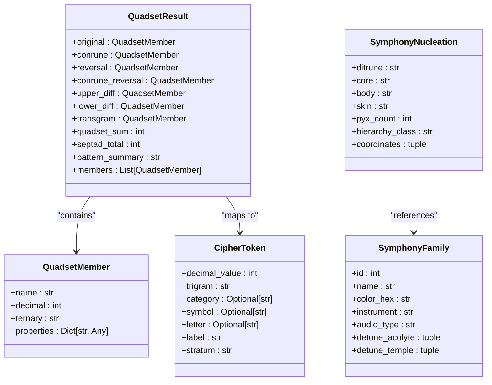
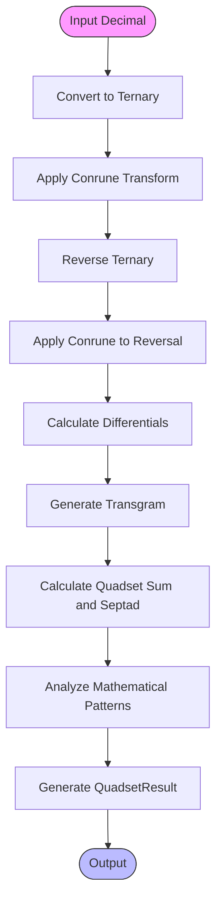
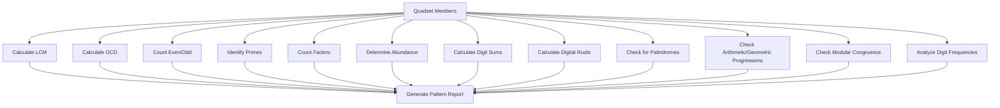
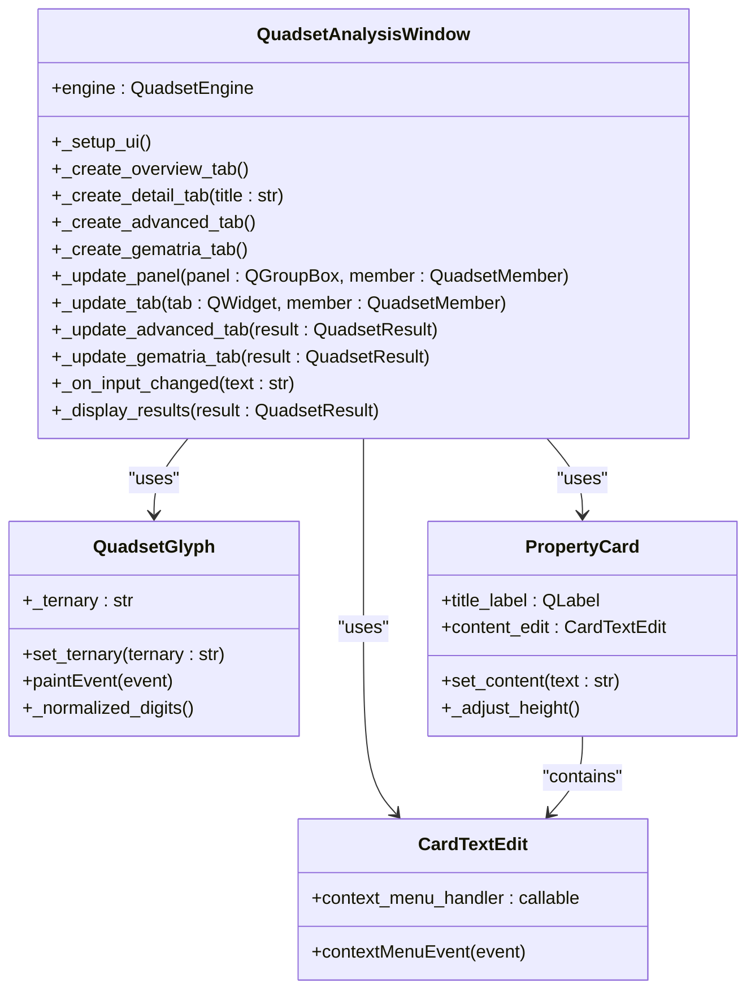
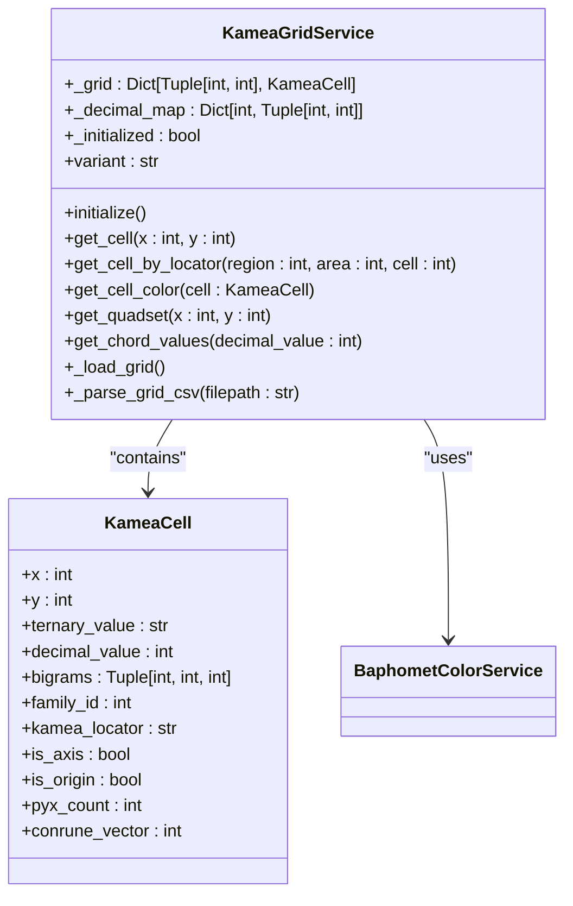
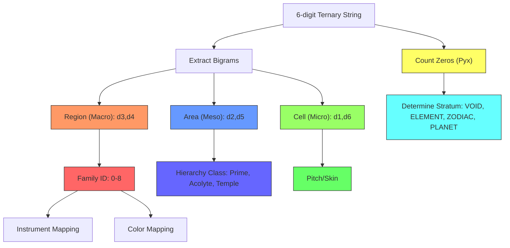
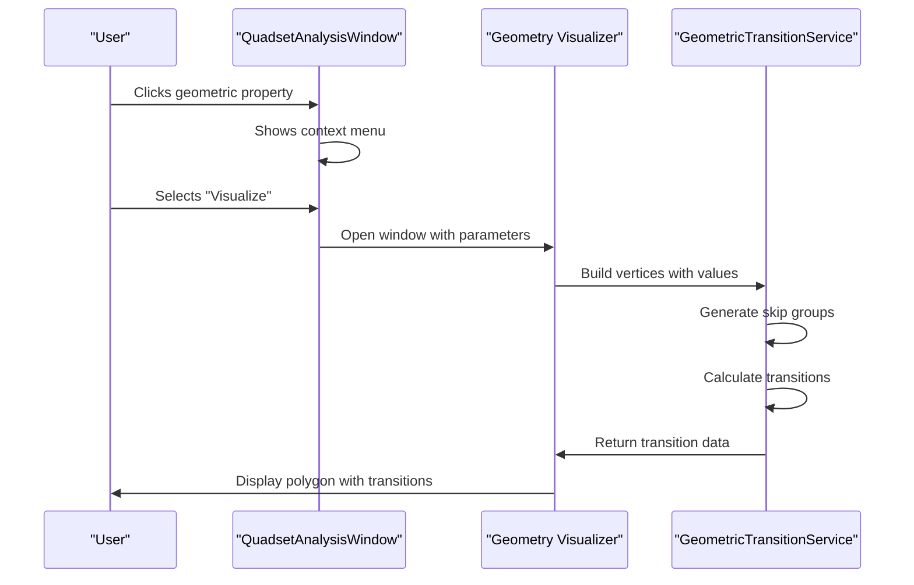
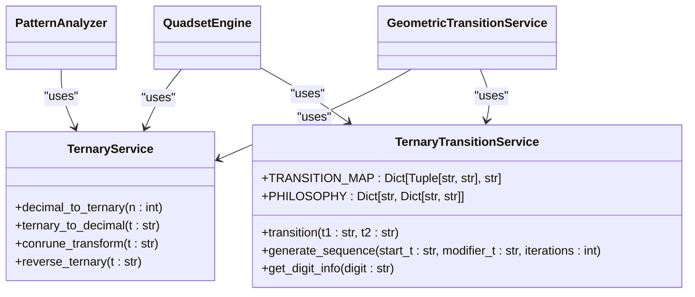

# Quadset Analysis

<cite>
**Referenced Files in This Document**   
- [quadset_analysis_window.py](file://src/pillars/tq/ui/quadset_analysis_window.py)
- [quadset_engine.py](file://src/pillars/tq/services/quadset_engine.py)
- [quadset_models.py](file://src/pillars/tq/models/quadset_models.py)
- [cipher_token.py](file://src/pillars/tq/models/cipher_token.py)
- [symphony_config.py](file://src/pillars/tq/models/symphony_config.py)
- [ternary_service.py](file://src/pillars/tq/services/ternary_service.py)
- [ternary_transition_service.py](file://src/pillars/tq/services/ternary_transition_service.py)
- [pattern_analyzer.py](file://src/pillars/tq/services/pattern_analyzer.py)
- [number_properties.py](file://src/pillars/tq/services/number_properties.py)
- [kamea_grid_service.py](file://src/pillars/tq/services/kamea_grid_service.py)
- [geometric_transition_service.py](file://src/pillars/tq/services/geometric_transition_service.py)
- [kamea_cell.py](file://src/pillars/tq/models/kamea_cell.py)
</cite>

## Table of Contents
1. [Introduction](#introduction)
2. [Core Domain Model](#core-domain-model)
3. [Quadset Engine Implementation](#quadset-engine-implementation)
4. [UI Components and Visualization](#ui-components-and-visualization)
5. [Trigram Processing and Kamea Mappings](#trigram-processing-and-kamea-mappings)
6. [Integration with Other TQ Subsystems](#integration-with-other-tq-subsystems)
7. [Pattern Recognition and Edge Cases](#pattern-recognition-and-edge-cases)
8. [Conclusion](#conclusion)

## Introduction

The Quadset Analysis subsystem is a core component of the TQ pillar, designed to analyze numerical patterns through ternary transformations and geometric mappings. This system processes input numbers through a series of mathematical operations to generate quadsets—collections of four related numbers derived from the original input through conrune transformations and reversals. The analysis reveals deep mathematical relationships and patterns that connect to broader systems within the TQ framework, including geometric transitions, ternary conversion, and Kamea grid mappings.

The subsystem serves as a bridge between numerical analysis and symbolic interpretation, transforming decimal inputs into ternary representations that can be mapped to trigram patterns, cipher tokens, and geometric configurations. This documentation provides a comprehensive overview of the implementation, focusing on the quadset_engine's processing pipeline, the domain model classes, UI components for interactive analysis, and the relationships between quadset analysis and other TQ subsystems.

**Section sources**
- [quadset_analysis_window.py](file://src/pillars/tq/ui/quadset_analysis_window.py#L1-L986)
- [quadset_engine.py](file://src/pillars/tq/services/quadset_engine.py#L1-L87)

## Core Domain Model

The Quadset Analysis subsystem is built around several key domain models that represent the fundamental entities and relationships within the system. These models provide the data structure for transporting calculation results between the engine and UI components.

### Quadset and Cipher Models

The primary models in the system are `QuadsetMember`, `QuadsetResult`, `CipherToken`, and `SymphonyConfig`, each serving a specific purpose in the analysis pipeline.



**Diagram sources**
- [quadset_models.py](file://src/pillars/tq/models/quadset_models.py#L1-L41)
- [cipher_token.py](file://src/pillars/tq/models/cipher_token.py#L1-L35)
- [symphony_config.py](file://src/pillars/tq/models/symphony_config.py#L1-L46)

The `QuadsetMember` class represents a single number within the quadset analysis, containing its name, decimal value, ternary representation, and calculated properties. The `QuadsetResult` class aggregates four main members (original, conrune, reversal, and conrune reversal) along with differential values and pattern analysis results. The `CipherToken` class maps decimal values (0-26) to their trigram representations and symbolic correspondences, with the `stratum` property determining the ontological level based on the count of zeros in the trigram. The `SymphonyConfig` module defines musical and visual mappings for different ternary patterns.

**Section sources**
- [quadset_models.py](file://src/pillars/tq/models/quadset_models.py#L1-L41)
- [cipher_token.py](file://src/pillars/tq/models/cipher_token.py#L1-L35)
- [symphony_config.py](file://src/pillars/tq/models/symphony_config.py#L1-L46)

## Quadset Engine Implementation

The `QuadsetEngine` is the core processing component that orchestrates the transformation pipeline and generates the complete quadset analysis. It coordinates multiple services to perform the mathematical operations and pattern analysis.

### Processing Pipeline

The engine follows a systematic pipeline to transform the input decimal number through various stages of analysis:



**Diagram sources**
- [quadset_engine.py](file://src/pillars/tq/services/quadset_engine.py#L1-L87)
- [ternary_service.py](file://src/pillars/tq/services/ternary_service.py#L1-L114)

The engine begins by converting the input decimal to its ternary representation using the `TernaryService`. It then applies the conrune transformation (which maps 0→0, 1→2, 2→1) to generate the conrune member. The original ternary is reversed to create the reversal member, and the conrune transformation is applied to this reversal to generate the fourth member. The engine calculates upper and lower differentials as absolute differences between related members, then generates a transgram through ternary transition between the differentials. Finally, it calculates the quadset sum (sum of the four main members) and septad total (sum including differentials and transgram), while the `PatternAnalyzer` generates a comprehensive report of mathematical patterns.

**Section sources**
- [quadset_engine.py](file://src/pillars/tq/services/quadset_engine.py#L1-L87)
- [ternary_service.py](file://src/pillars/tq/services/ternary_service.py#L1-L114)
- [ternary_transition_service.py](file://src/pillars/tq/services/ternary_transition_service.py#L1-L70)
- [pattern_analyzer.py](file://src/pillars/tq/services/pattern_analyzer.py#L1-L163)

### Pattern Analysis

The `PatternAnalyzer` service performs comprehensive mathematical analysis on the quadset members, identifying various numerical patterns and relationships:



**Diagram sources**
- [pattern_analyzer.py](file://src/pillars/tq/services/pattern_analyzer.py#L1-L163)
- [number_properties.py](file://src/pillars/tq/services/number_properties.py#L1-L230)

The pattern analysis includes calculating the least common multiple (LCM) and greatest common divisor (GCD) of the quadset decimals, identifying prime numbers, analyzing factor counts, determining abundance status (perfect, deficient, or abundant), calculating digit sums and digital roots, checking for decimal and ternary palindromes, identifying arithmetic and geometric progressions, testing modular congruence, and analyzing digit frequencies in the ternary representations. This comprehensive analysis reveals deep mathematical relationships within the quadset.

**Section sources**
- [pattern_analyzer.py](file://src/pillars/tq/services/pattern_analyzer.py#L1-L163)
- [number_properties.py](file://src/pillars/tq/services/number_properties.py#L1-L230)

## UI Components and Visualization

The `QuadsetAnalysisWindow` provides an interactive interface for exploring quadset analysis results, featuring multiple tabs for different views of the data and visualizations of ternary patterns.

### User Interface Structure

The UI is organized into a comprehensive set of tabs that present the analysis results at different levels of detail:

```mermaid
graph TB
Window["QuadsetAnalysisWindow"] --> OverviewTab["Quadset Overview Tab"]
Window --> DetailTabs["Detail Tabs"]
Window --> AdvancedTab["Advanced Tab"]
Window --> GematriaTab["Gematria Tab"]
OverviewTab --> Grid["2x2 Grid: Original, Conrune, Reversal, Conrune Reversal"]
OverviewTab --> Differences["Differences: Upper and Lower"]
DetailTabs --> Original["Original Tab"]
DetailTabs --> Conrune["Conrune Tab"]
DetailTabs --> Reversal["Reversal Tab"]
DetailTabs --> ConruneRev["Conrune Reversal Tab"]
DetailTabs --> UpperDiff["Upper Diff Tab"]
DetailTabs --> LowerDiff["Lower Diff Tab"]
AdvancedTab --> Totals["Quadset Sum and Septad Total"]
AdvancedTab --> Transgram["Differential Transgram"]
AdvancedTab --> Patterns["Pattern Summary"]
GematriaTab --> SubTabs["Sub-tabs for each number type"]
SubTabs --> OriginalGem["Original"]
SubTabs --> ConruneGem["Conrune"]
SubTabs --> ReverseGem["Reverse"]
SubTabs --> ReciprocalGem["Reciprocal"]
SubTabs --> UpperDiffGem["Upper Diff"]
SubTabs --> LowerDiffGem["Lower Diff"]
DetailTabs --> PropertyCards["Property Cards"]
PropertyCards --> Type["Number Type"]
PropertyCards --> Factorization["Prime Factorization"]
PropertyCards --> Factors["Factors Analysis"]
PropertyCards --> Geometry["Geometric Properties"]
PropertyCards --> Digits["Digit Sum"]
```



**Diagram sources**
- [quadset_analysis_window.py](file://src/pillars/tq/ui/quadset_analysis_window.py#L1-L986)

The main window features a 2x2 grid displaying the four primary quadset members (original, conrune, reversal, and conrune reversal) with their decimal and ternary representations. Below this grid, the upper and lower differentials are displayed. Each member has a dedicated detail tab showing comprehensive properties including number type, prime factorization, factors analysis, geometric properties, and digit sum. The advanced tab displays aggregate values like the quadset sum and septad total, along with the differential transgram and pattern summary. The gematria tab provides database lookups for each number, showing associated words, methods, tags, and notes.

**Section sources**
- [quadset_analysis_window.py](file://src/pillars/tq/ui/quadset_analysis_window.py#L1-L986)

### Visual Representations

The UI includes specialized components for visualizing ternary patterns and enabling interactive exploration of geometric properties:



**Diagram sources**
- [quadset_analysis_window.py](file://src/pillars/tq/ui/quadset_analysis_window.py#L1-L986)

The `QuadsetGlyph` component visualizes ternary strings as Taoist line glyphs, with zeros represented as circles, ones as solid lines, and twos as broken lines. The `PropertyCard` displays specific number properties with expandable content, and the `CardTextEdit` enables context menu interactions for geometric properties. When users click on geometric property entries, a context menu appears allowing them to visualize the corresponding polygonal number in a separate geometry window.

**Section sources**
- [quadset_analysis_window.py](file://src/pillars/tq/ui/quadset_analysis_window.py#L1-L986)

## Trigram Processing and Kamea Mappings

The quadset analysis system integrates with the Kamea grid and cipher token system to provide symbolic interpretations of numerical patterns. This integration connects the mathematical analysis to a broader system of trigram correspondences and geometric mappings.

### Kamea Grid Integration

The Kamea grid service provides a 27x27 coordinate system that maps decimal values to ternary representations and geometric positions:



**Diagram sources**
- [kamea_grid_service.py](file://src/pillars/tq/services/kamea_grid_service.py#L1-L220)
- [kamea_cell.py](file://src/pillars/tq/models/kamea_cell.py#L1-L59)

The `KameaGridService` loads data from CSV files to create a complete 27x27 grid of `KameaCell` objects, each with Cartesian coordinates, decimal and ternary values, and bigram components. The service can retrieve cells by coordinates or by their Kamea locator (region-area-cell), and it provides methods to get quadsets of related cells based on geometric symmetry. The `KameaCell` class includes properties for determining the cell's position relative to axes, its dimensional density (count of zeros), and the magnitude of its conrune vector.

**Section sources**
- [kamea_grid_service.py](file://src/pillars/tq/services/kamea_grid_service.py#L1-L220)
- [kamea_cell.py](file://src/pillars/tq/models/kamea_cell.py#L1-L59)

### Trigram to Cipher Mapping

The system maps ternary patterns to cipher tokens, establishing connections between numerical analysis and symbolic interpretation:



**Diagram sources**
- [cipher_token.py](file://src/pillars/tq/models/cipher_token.py#L1-L35)
- [symphony_config.py](file://src/pillars/tq/models/symphony_config.py#L1-L46)

Each 6-digit ternary string is divided into three bigrams that determine different aspects of the cipher token. The macro bigram (digits 3-4) determines the region and family ID, which maps to musical instruments and colors. The meso bigram (digits 2,5) determines the area and hierarchy class. The micro bigram (digits 1,6) determines the cell and pitch. The count of zeros (Pyx) determines the ontological stratum, with 3 zeros indicating VOID (Potential), 2 zeros indicating ELEMENT (Fundamental State), 1 zero indicating ZODIAC (Cycle), and 0 zeros indicating PLANET (Entity).

**Section sources**
- [cipher_token.py](file://src/pillars/tq/models/cipher_token.py#L1-L35)
- [symphony_config.py](file://src/pillars/tq/models/symphony_config.py#L1-L46)

## Integration with Other TQ Subsystems

The quadset analysis system is deeply integrated with other TQ subsystems, creating a cohesive framework for numerical and geometric analysis. These integrations enable cross-functional analysis and visualization of patterns.

### Geometric Transitions

The quadset analysis connects to the geometric transition system, allowing users to visualize numerical relationships as polygonal patterns:



**Diagram sources**
- [quadset_analysis_window.py](file://src/pillars/tq/ui/quadset_analysis_window.py#L597-L687)
- [geometric_transition_service.py](file://src/pillars/tq/services/geometric_transition_service.py#L1-L323)

When users click on geometric property entries in the quadset analysis window, they can visualize the corresponding polygonal number in a geometry window. The system passes parameters like the number of sides, index, and mode (polygonal, centered, or star) to the geometry visualizer, which uses the `GeometricTransitionService` to generate vertices and transitions. This integration allows users to see how numerical properties manifest as geometric patterns.

**Section sources**
- [quadset_analysis_window.py](file://src/pillars/tq/ui/quadset_analysis_window.py#L597-L687)
- [geometric_transition_service.py](file://src/pillars/tq/services/geometric_transition_service.py#L1-L323)

### Ternary Conversion System

The quadset analysis is built upon the ternary conversion system, which provides fundamental operations for transforming between decimal and ternary representations:



**Diagram sources**
- [ternary_service.py](file://src/pillars/tq/services/ternary_service.py#L1-L114)
- [ternary_transition_service.py](file://src/pillars/tq/services/ternary_transition_service.py#L1-L70)

The `TernaryService` provides core functionality for converting between decimal and ternary representations, applying the conrune transformation, and reversing ternary strings. The `TernaryTransitionService` implements the Ternary Transition System with a specific mapping for combining two ternary digits, along with philosophical interpretations of each digit (0 as Tao/Equilibrium, 1 as Yang/Outward motion, 2 as Yin/Inward motion). These services are used by multiple components across the TQ system, creating a consistent foundation for ternary analysis.

**Section sources**
- [ternary_service.py](file://src/pillars/tq/services/ternary_service.py#L1-L114)
- [ternary_transition_service.py](file://src/pillars/tq/services/ternary_transition_service.py#L1-L70)

## Pattern Recognition and Edge Cases

The quadset analysis system includes robust handling of edge cases and provides comprehensive pattern recognition capabilities to identify mathematical relationships within the data.

### Edge Case Handling

The system implements careful validation and error handling for various edge cases that may arise during analysis:

```mermaid
flowchart TD
Input["Input Processing"] --> Validation["Validate Input"]
Validation --> |Valid| Processing["Process Normal Case"]
Validation --> |Invalid| ErrorHandling["Handle Error"]
Processing --> Zero["Handle Zero Input"]
Processing --> Negative["Handle Negative Numbers"]
Processing --> Large["Handle Large Numbers"]
Zero --> |decimal_to_ternary| "Return '0'"
Negative --> |Preserve sign| "Process absolute value"
Large --> |prime_ordinal| "Return -1 for n > 1,000,000"
ErrorHandling --> |ValueError| "Graceful degradation"
ErrorHandling --> |Empty input| "Clear UI"
ErrorHandling --> |Invalid ternary| "Raise ValueError"
style Validation fill:#f96,stroke:#333
style Processing fill:#6f9,stroke:#333
style ErrorHandling fill:#f66,stroke:#333
```

**Diagram sources**
- [ternary_service.py](file://src/pillars/tq/services/ternary_service.py#L1-L114)
- [number_properties.py](file://src/pillars/tq/services/number_properties.py#L1-L230)
- [quadset_analysis_window.py](file://src/pillars/tq/ui/quadset_analysis_window.py#L948-L961)

The system handles zero as a special case in ternary conversion, returning "0" directly. Negative numbers are processed by preserving the sign while converting the absolute value. For very large numbers, the prime ordinal calculation returns -1 when the number exceeds 1,000,000 to prevent excessive computation time. Invalid inputs are handled gracefully, with the UI clearing when input is removed and validation errors preventing processing of malformed data.

**Section sources**
- [ternary_service.py](file://src/pillars/tq/services/ternary_service.py#L1-L114)
- [number_properties.py](file://src/pillars/tq/services/number_properties.py#L1-L230)
- [quadset_analysis_window.py](file://src/pillars/tq/ui/quadset_analysis_window.py#L948-L961)

### Comprehensive Pattern Detection

The pattern recognition system identifies a wide range of mathematical relationships within the quadset:

```mermaid
graph TD
Patterns["Pattern Detection"] --> LCMGCD["LCM and GCD"]
Patterns --> Parity["Even/Odd Count"]
Patterns --> Primes["Prime Identification"]
Patterns --> Factors["Factor Analysis"]
Patterns --> Abundance["Abundance Status"]
Patterns --> DigitOps["Digit Operations"]
Patterns --> Palindromes["Palindrome Detection"]
Patterns --> Progressions["Progression Detection"]
Patterns --> Congruence["Modular Congruence"]
Patterns --> DigitFreq["Digit Frequency Analysis"]
DigitOps --> DigitSum["Digit Sum"]
DigitOps --> DigitalRoot["Digital Root"]
Palindromes --> DecimalPal["Decimal Palindromes"]
Palindromes --> TernaryPal["Ternary Palindromes"]
Progressions --> Arithmetic["Arithmetic Progression"]
Progressions --> Geometric["Geometric Progression"]
Congruence --> Mod3["Congruent mod 3"]
Congruence --> Mod5["Congruent mod 5"]
DigitFreq --> BinaryLike["Binary-like (0/1 only)"]
DigitFreq --> FrequencyCount["Digit Count (0,1,2)"]
```



**Diagram sources**
- [pattern_analyzer.py](file://src/pillars/tq/services/pattern_analyzer.py#L1-L163)

The pattern detection system identifies relationships across multiple mathematical domains, including number theory (primes, factors, abundance), arithmetic (LCM, GCD, progressions), modular arithmetic (congruence), and digit-based patterns (palindromes, digit sums, frequencies). This comprehensive approach reveals both obvious and subtle relationships within the quadset, providing users with deep insights into the mathematical structure of their input.

**Section sources**
- [pattern_analyzer.py](file://src/pillars/tq/services/pattern_analyzer.py#L1-L163)

## Conclusion

The Quadset Analysis subsystem provides a sophisticated framework for exploring numerical patterns through ternary transformations and geometric mappings. By integrating mathematical analysis with symbolic interpretation, the system reveals deep relationships within numerical data that connect to broader concepts in the TQ pillar.

The implementation centers around the `QuadsetEngine`, which orchestrates a pipeline of transformations to generate quadsets from input numbers. These quadsets are then analyzed for a comprehensive set of mathematical patterns, with results presented through an intuitive UI that supports interactive exploration. The system's integration with the Kamea grid, cipher tokens, and geometric transition subsystems creates a cohesive framework for multidimensional analysis.

For beginners, the system provides accessible visualizations and clear presentations of mathematical properties. For experienced developers, the modular architecture and well-defined interfaces offer opportunities for extension and customization. The robust handling of edge cases and comprehensive pattern recognition make the system reliable for both casual exploration and serious research.

The quadset analysis demonstrates how mathematical operations can be connected to symbolic systems, creating a bridge between quantitative analysis and qualitative interpretation. This approach enables users to discover meaningful patterns in numerical data that might otherwise remain hidden, making it a powerful tool for research and exploration within the TQ framework.