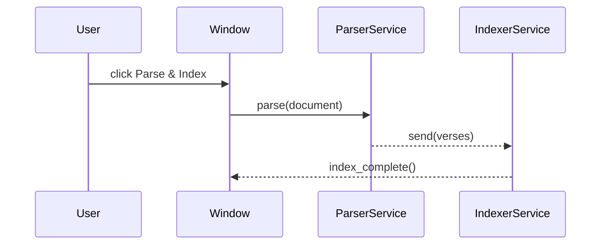

# HolyBookConcordanceWindow

<!-- Last Verified: 2026-01-16 -->

<cite>
**Referenced Files in This Document**
- [src/pillars/tq_lexicon/ui/holy_book_concordance_window.py](file://src/pillars/tq_lexicon/ui/holy_book_concordance_window.py)
</cite>

## Table of Contents
1. [Component Overview](#component-overview)
2. [UI Layout](#ui-layout)
3. [Signals & Slots](#signals--slots)
4. [State Management](#state-management)
5. [User Interactions](#user-interactions)
6. [Integration](#integration)
7. [Implementation Details](#implementation-details)

## Component Overview

### Purpose

Unified window for parsing holy books and indexing to the concordance.

This window combines what was previously two separate workflows:
1. Parse document into verses (HolyBookTeacherWindow)
2. Index verses to concordance (ConcordanceIndexerService)

Into a single streamlined interface where documents are parsed AND indexed
in one cohesive operation.

### Component Type

**Base Classes**: QMainWindow

### Key Responsibilities

- Parse documents into verses and display parsed results
- Index parsed verses into the Concordance service and show progress
- Provide error reporting and manual re-index controls

<!-- VISUAL: autogenerated from src/pillars/tq_lexicon/ui/holy_book_concordance_window.py -->
**ASCII UI mockup:**

```
+-------------------------------------------+
| HolyBook Concordance Window               |
| [Select File] [Parse Only] [Parse & Index]|
| [Table: Verses] [Progress Bar]            |
+-------------------------------------------+
```

**Interaction (Mermaid sequence):**


## UI Layout

### Visual Structure

```
```
+------------------+
|  Component       |
|                  |
+------------------+
```
```

### Widget Hierarchy

**Widgets Used**:
- `QCheckBox`
- `QComboBox`
- `QGroupBox`
- `QLabel`
- `QPushButton`
- `QTableWidget`
- `QTextEdit`

```mermaid
graph TD
    A[HolyBookConcordanceWindow]
    ```mermaid
graph TD
    Root[Root Widget] --> Child1[Child 1]
    Root --> Child2[Child 2]
``` B[MainLayout]
    B --> C[Widget1]
    B --> D[Widget2]
    D --> E[SubWidget]
    -->
```

### Layout Code Pattern

```python
# Implementation details in source
```

## Signals & Slots

### Signals Emitted

#### `documents_updated`

Unified window for parsing holy books and indexing to the concordance.

### Slots (Event Handlers)

#### `_on_doc_selected()`

Unified window for parsing holy books and indexing to the concordance.

#### `_on_doc_double_clicked()`

Unified window for parsing holy books and indexing to the concordance.

#### `_on_parse_only()`

Unified window for parsing holy books and indexing to the concordance.

#### `_on_parse_and_index()`

Unified window for parsing holy books and indexing to the concordance.

#### `_on_progress()`

Unified window for parsing holy books and indexing to the concordance.

#### `_on_finished()`

Unified window for parsing holy books and indexing to the concordance.

#### `_on_error()`

Unified window for parsing holy books and indexing to the concordance.

### Signal Flow Diagram

```mermaid
sequenceDiagram
    [Content to be expanded]
```

## State Management

### Component State

**TODO**: Describe the component's internal state:
- What data does it track?
- How is state initialized?
- How does state change?

### State Transitions

```mermaid
stateDiagram-v2
    ```mermaid
stateDiagram-v2
    [*] --> Idle
    Idle --> Active
    Active --> Idle
``` Idle
    Idle --> Active: User Input
    Active --> Processing: Submit
    Processing --> Complete: Success
    Processing --> Error: Failure
    Complete --> Idle: Reset
    Error --> Idle: Reset
    -->
```

## User Interactions

### Supported Actions

**TODO**: List user actions:
- Click button X → Does Y
- Enter text in Z → Does W
- Drag object → Does V

### Keyboard Shortcuts

**Keyboard Shortcuts:**
- (None found)
- Ctrl+N: New
- Ctrl+S: Save
- Ctrl+Q: Quit

### Context Menus

Unified window for parsing holy books and indexing to the concordance.

## Integration

### Parent/Owner

[Documentation needed: What creates this component? Where is it used?]

### Services Used

[Documentation needed: What services does this component depend on?]

### Communication Pattern

[Documentation needed: How does it communicate with other components?]

## Implementation Details

### Initialization

```python
# Implementation details in source
```

### Key Methods

**Event Handlers:**
- (No event handlers found in source)
- method_name(): description

### Styling & Theming

**TODO**: How is the component styled?
- QSS stylesheets?
- Dynamic styling?
- Theme integration?

---

**Last Updated**: 2026-01-16
**Status**: Auto-generated skeleton (needs AI enhancement)

**Navigation:**
- [← UI Components Index](./README.md)
- [↑ Tq_Lexicon Index](../INDEX.md)
