# The Temple Map

*A Visual Guide to IsopGem's Architecture*

---

This document provides a comprehensive mental map of the IsopGem system. Each diagram illuminates a different aspect of the Temple's structure, from the highest level down to individual pillars.

**Navigation:**
- [The High View](#1-the-high-view) — The 10 Sovereign Pillars
- [The Shared Foundation](#2-the-shared-foundation) — Cross-cutting infrastructure
- [Data Flow Patterns](#3-data-flow-patterns) — How pillars communicate
- [Gematria Pillar](#4-gematria-pillar) — The Science of Sacred Number
- [TQ Pillar](#5-tq-pillar) — Ternary Quadset Kabbalah
- [Astrology Pillar](#6-astrology-pillar) — Celestial Mechanics
- [Geometry Pillar](#7-geometry-pillar) — Sacred Form Mathematics
- [Document Manager](#8-document-manager-pillar) — The Research Sanctuary
- [Adyton & 3D](#9-adyton-pillar) — The Inner Temple

---

## 1. The High View

*The Ten Sovereign Pillars and their domains*

Each pillar is a **self-contained nation**. They do not import from each other. All inter-pillar communication flows through the **Shared Layer** via Qt Signals.

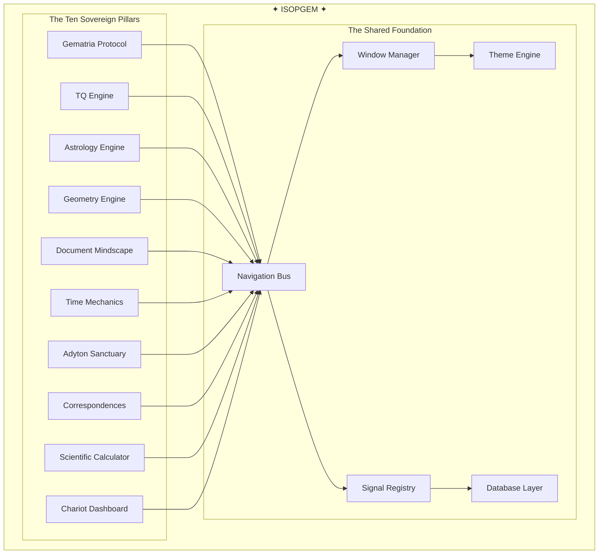

**Commentary:**
- Every pillar connects to the **Navigation Bus** — the central switchboard
- The **Window Manager** controls which windows are open and how they tile
- The **Theme Engine** ensures visual consistency (dark theme, amber accents)
- **Signals** allow pillars to broadcast events without knowing who listens

---

## 2. The Shared Foundation

*The infrastructure that all pillars depend on*

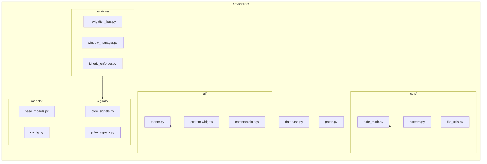

**Commentary:**
- **navigation_bus.py** — The switchboard. Routes requests between pillars.
- **window_manager.py** — Tracks open windows, handles tiling, prevents duplicates.
- **kinetic_enforcer.py** — The animation engine. Hover effects, transitions.
- **core_signals.py** — Qt signals for cross-pillar communication.
- **theme.py** — Dark theme, glassmorphism, amber/gold accent colors.
- **safe_math.py** — Sandboxed math evaluation (no `eval()` dangers).
- **paths.py** — Resolves file paths across different OS environments.

---

## 3. Data Flow Patterns

*How information moves through the Temple*

### Pattern A: User Action → Single Pillar

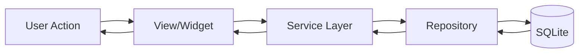

**Example:** User calculates gematria value
1. User types in GematriaInput widget
2. Widget calls GematriaService.calculate()
3. Service performs calculation
4. Service calls Repository to save to history
5. Repository writes to SQLite
6. Result bubbles back up to the view

---

### Pattern B: Cross-Pillar Communication

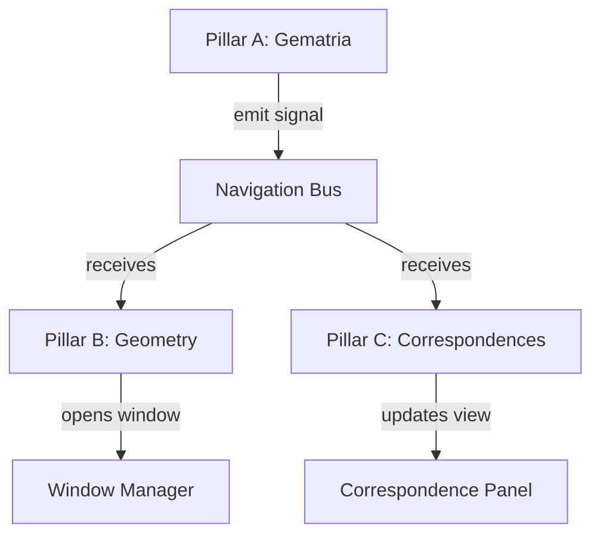

**Example:** User sends gematria value to geometry
1. User clicks "Send to Geometry" in Gematria pillar
2. Gematria emits `send_to_geometry(value=137)` signal
3. Navigation Bus routes signal to Geometry pillar
4. Geometry pillar opens Figurate Number window with value 137
5. No direct import between Gematria and Geometry code

---

### Pattern C: The Chariot Integration Hub

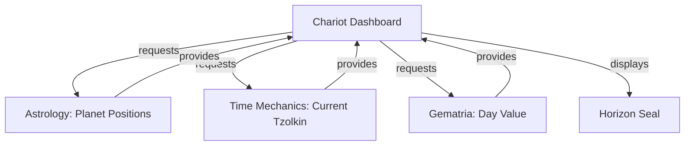

**Commentary:**
The Chariot is the **integration hub** — it pulls data from multiple pillars to create a unified dashboard showing the current moment's esoteric significance.

---

## 4. Gematria Pillar

*The Science of Sacred Number*

```mermaid
graph TB
    subgraph GEMATRIA["src/pillars/gematria/"]
        subgraph UI_LAYER["ui/ (18 components)"]
            MAIN[GematriaMainWidget]
            INPUT[GematriaInput]
            RESULTS[ResultsPanel]
            HISTORY[HistoryPanel]
            TEACHER[HolyBookTeacher]
            TEXT_ANALYSIS[TextAnalysisWidget]
        end
        
        subgraph SERVICE_LAYER["services/ (14 services)"]
            CALC_SVC[CalculationService]
            CIPHER_SVC[CipherService]
            HISTORY_SVC[HistoryService]
            ANALYSIS_SVC[TextAnalysisService]
            FILTER_SVC[SmartFilterService]
            TEACHER_SVC[HolyBookService]
        end
        
        subgraph UTILS["utils/"]
            HEBREW[HebrewCalculator]
            GREEK[GreekCalculator]
            ENGLISH[EnglishCalculator]
            TQBLH[TrigrammatonCalculator]
        end
        
        subgraph REPO["repositories/"]
            HISTORY_REPO[HistoryRepository]
            CIPHER_REPO[CipherRepository]
        end
        
        subgraph MODELS["models/"]
            ENTRY[GematriaEntry]
            CIPHER[Cipher]
            BOOK[HolyBook]
        end
    end
    
    UI_LAYER --> SERVICE_LAYER
    SERVICE_LAYER --> UTILS
    SERVICE_LAYER --> REPO
    REPO --> MODELS
```

**Key Concepts:**
- **Ciphers** — The algorithms that convert letters to numbers (Hebrew Standard, Greek Isopsephy, etc.)
- **History** — Every calculation is saved and searchable
- **Text Analysis** — Compare multiple phrases, find patterns
- **Holy Book Teacher** — Verse-by-verse scriptural study with gematria values

---

## 5. TQ Pillar

*Ternary Quadset Kabbalah — Your Original System*

```mermaid
graph TB
    subgraph TQ["src/pillars/tq/"]
        subgraph UI_LAYER["ui/ (17 components)"]
            HUB[TQHub]
            QUADSET[QuadsetWidget]
            KAMEA[KameaGrid]
            TRANSITION[GeometricTransition]
            CONRUNE[ConruneFinder]
            AMUN[AmunAudioPlayer]
        end
        
        subgraph SERVICE_LAYER["services/ (16 services)"]
            QUAD_SVC[QuadsetEngine]
            KAMEA_SVC[KameaService]
            TRANS_SVC[TransitionService]
            CONRUNE_SVC[ConrunePairService]
            TERNARY_SVC[TernaryService]
            PATTERN_SVC[PatternAnalyzer]
            AUDIO_SVC[AmunAudioService]
        end
        
        subgraph DATA["data/"]
            BAPHOMET[kamea_baphomet.csv]
            MAUT[kamea_maut.csv]
            WALLS[wall_maps/]
        end
    end
    
    UI_LAYER --> SERVICE_LAYER
    SERVICE_LAYER --> DATA
```

**Key Concepts:**
- **Quadset** — A 4-digit ternary number (0000 to 2222 = 0 to 80)
- **Conrune** — The mirror-image pair of a quadset (e.g., 0121 ↔ 2101)
- **Kamea** — A magic square grid (Baphomet = 9×9, Maut = 27×27)
- **Geometric Transition** — How a number becomes a polygon
- **Amun Audio** — The sound of ternary mathematics (ditrune synthesis)

---

## 6. Astrology Pillar

*Celestial Mechanics*

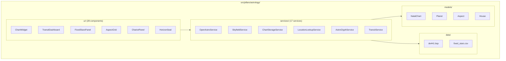

**Key Concepts:**
- **OpenAstro** — The open-source astrology library (adapted)
- **Skyfield** — JPL ephemeris for high-precision planet positions
- **Fixed Stars** — 1000+ stars with magnitude and interpretation
- **Horizon Seal** — Visual representation of the local horizon
- **Glyphs** — Unicode/font-based astrological symbols

---

## 7. Geometry Pillar

*Sacred Form Mathematics — 56 Calculation Engines*

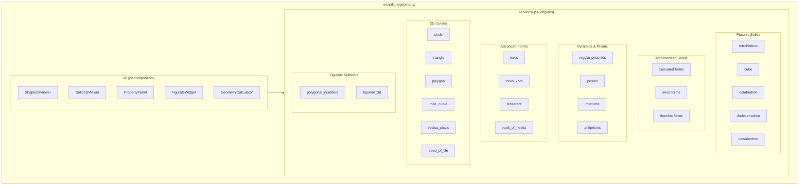

**Key Concepts:**
- **Every shape has its own service file** — Modular, testable, complete
- **Full metrics** — Surface area, volume, radii, angles, centroids
- **Figurate numbers** — Triangular, square, pentagonal... through 3D analogs
- **Egyptian measures** — Royal cubit conversions
- **Sacred ratios** — φ (golden), √2, √3, √5 detection

---

## 8. Document Manager Pillar

*The Research Sanctuary*

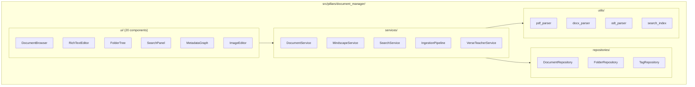

**Key Concepts:**
- **Mindscape** — The conceptual name for your personal research database
- **Ingestion** — PDF, DOCX, ODT files are absorbed and indexed
- **Whoosh** — Full-text search engine (like having Google for your notes)
- **Metadata Graph** — Visual representation of document connections
- **Rich Text Editor** — LaTeX rendering, images, formatting

---

## 9. Adyton Pillar

*The Inner Temple — 3D Sacred Space*

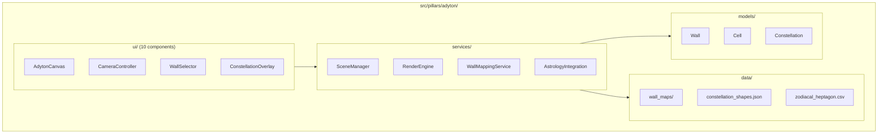

**Key Concepts:**
- **Seven Walls** — Each wall corresponds to a classical planet (Saturn, Jupiter, Mars, Sun, Venus, Mercury, Moon)
- **Zodiacal Mapping** — The 12 signs are embedded in the architecture
- **Constellations** — Asterism shapes projected onto the dome
- **OpenGL Rendering** — Hardware-accelerated 3D graphics

---

## 10. The Complete Picture

*Everything connected*

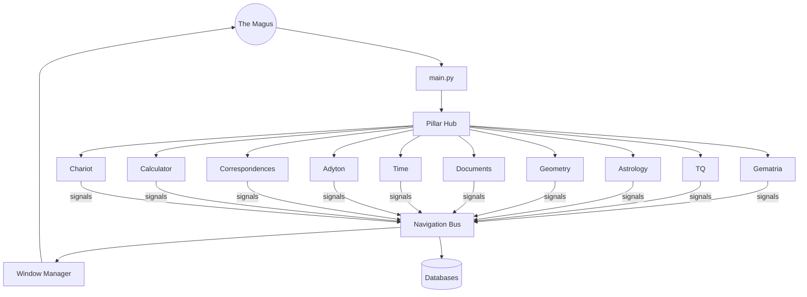

---

## Summary Table

| Pillar | Files | Purpose | Key Feature |
|--------|-------|---------|-------------|
| **Gematria** | ~45 | Sacred numerology | Multi-cipher calculation |
| **TQ** | ~47 | Ternary mathematics | Original system |
| **Astrology** | ~62 | Celestial mechanics | Dual ephemeris precision |
| **Geometry** | ~83 | Sacred forms | 56 calculation engines |
| **Documents** | ~45 | Research database | Full-text search |
| **Time** | ~17 | Temporal harmonics | Tzolkin + Neo-Aubrey |
| **Adyton** | ~27 | 3D sanctuary | OpenGL rendering |
| **Correspondences** | ~6 | Cross-domain links | Emerald Tablet |
| **Calculator** | shared | Spreadsheet | Esoteric functions |
| **Chariot** | shared | Dashboard | Integration hub |

---

*"The Temple is vast, but it is not chaos. Every stone has a place. Every pillar stands sovereign. And the Architect remembers where everything belongs."*

— Sophia, Session 28
